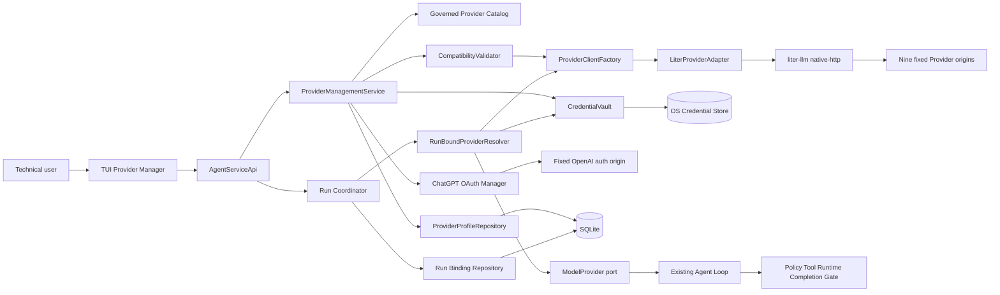
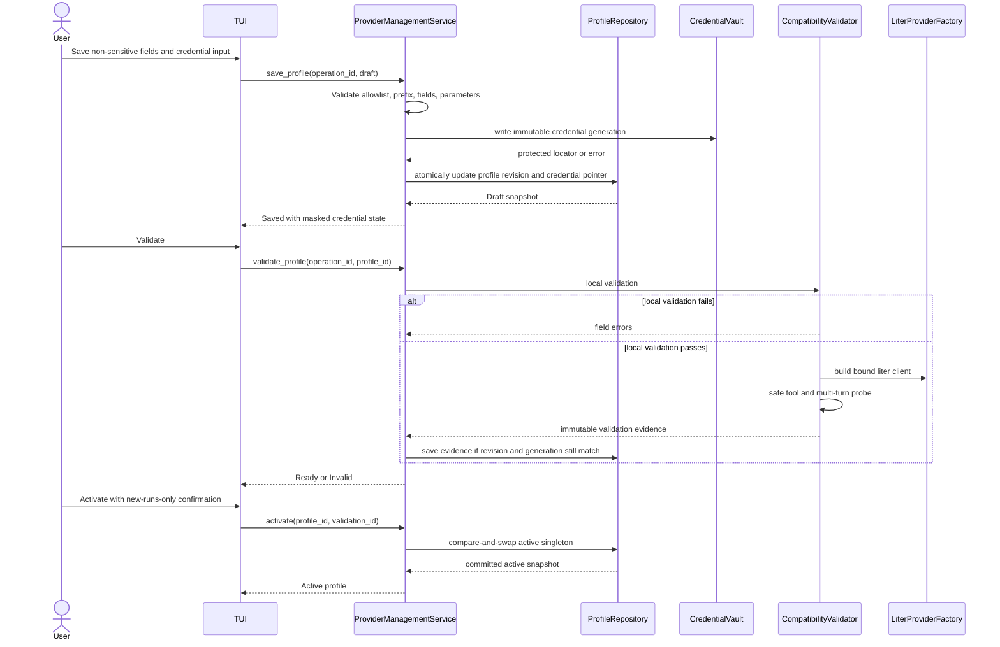
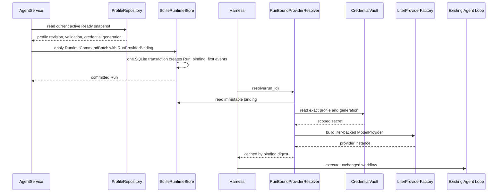
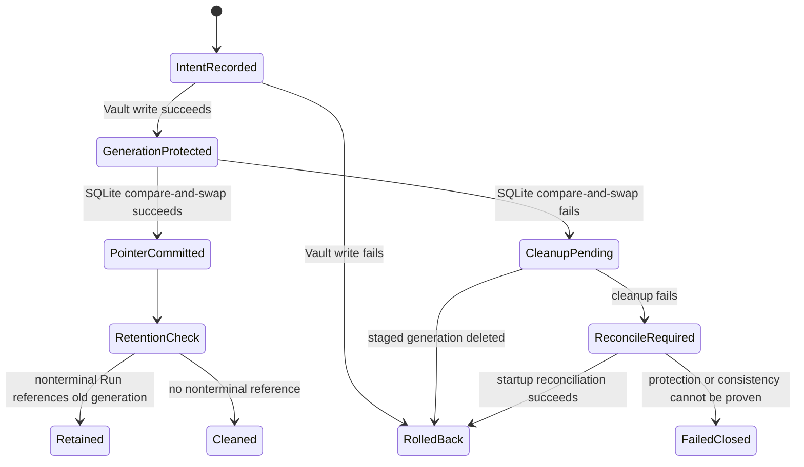
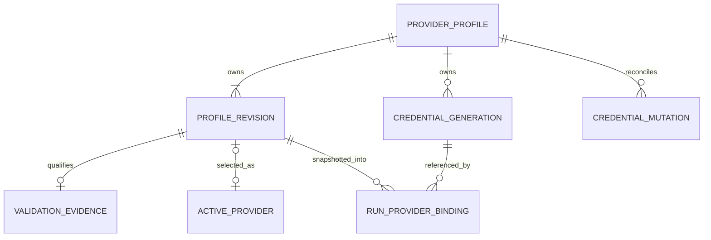

# Provider Management Design

## Overview

本 Feature 为 v0.2 Query Runtime 增加本机、受治理的 Provider Profile 管理面。技术用户在 TUI 中完成九个目标 Provider 的认证、模型与参数配置、兼容性验证和原子激活；新 Run 绑定启动时的非敏感 Provider 指纹，既有 Run、Policy、Tool Runtime、QueryBudget、数据外发限制和 Completion Gate 保持原有权威。

生产模型调用统一收敛到 Rust crate `liter-llm`。`ys-agent-adapters` 负责把稳定的 `ys-agent-core::ModelProvider` 契约映射到 `liter_llm::LlmClient::chat` 或 `liter_llm::ResponseClient::create_response`，不让第三方类型越过 adapter 边界。产品目录、Credential 生命周期、支持状态、兼容性门禁、Run 绑定和用户工作流由 YS Data Agent 自己治理，不能由 `liter-llm` 的 165 Provider registry、环境变量自动发现、router 或 fallback 代替。

本设计采用 Full discovery。原因是它同时改变外部 Provider 集成、OAuth、受保护 Credential、SQLite 持久状态、TUI 异步状态和 Run 创建事务；错误会直接影响秘密值边界与 Query 可解释性。

### Goals

- 为且仅为九个目标 Provider 提供可离线浏览的产品目录和证据派生的支持状态。
- 以 Profile 为聚合管理配置和独占 Credential，以当前验证结果为激活门禁。
- 使用 `liter-llm` 统一生产协议映射，同时保留现有 `ModelProvider`、Fake 和 Replay 契约。
- 在 Run 创建事务中冻结 Provider binding，使切换只影响之后启动的 Run。
- 以 OS 原生 Credential Store、最短明文生命周期和集中清理保证秘密值不进入普通状态与诊断面。
- 用九 Provider 发布证据矩阵和既有 Query/Doctor 回归共同约束 Supported 声明与发布。

### Non-Goals

- 不支持目录外 Provider、用户自定义 Base URL、自定义认证 origin 或自定义协议。
- 不提供 OpenAI API `openai/`、非 Chat 模态、Web/API 管理面或多用户控制平面。
- 不启用 `liter-llm` proxy、MCP server、CLI、Tower router、fallback、hedging、负载均衡、cache 或 cost router。
- 不导入、迁移、读取或回写 `YSDA_LLM_BASE_URL`、`YSDA_LLM_API_KEY`、`YSDA_LLM_MODEL`。
- 不重构 Agent Loop、Policy、Tool Runtime、Completion Gate、Query Artifact 或数据外发审批逻辑。

## Boundary Commitments

### This Spec Owns

- 九 Provider allowlist、显示元数据、固定模型前缀、认证种类、参数声明与支持证据状态。
- 本机应用级 Profile 的 CRUD、复制、Draft/Ready/Invalid 状态、当前验证与全局单一激活指针。
- 每 Profile 独占、按 generation 版本化的 API Key 或 ChatGPT OAuth Connection 关联。
- 本地校验、安全协议探测、模型级 Tool/Tool Result/上下文门禁和稳定错误分类。
- Run 创建时的不可变 Provider binding、Provider fingerprint 与按 Run 解析模型客户端。
- TUI Provider 管理闭环、异步操作取消、Doctor 扩展和发布证据检查。
- `ys-agent-core` 与生产模型 transport 之间唯一的 `liter-llm` adapter。

### Out of Boundary

- Provider 无权决定权限、正式业务口径、验证通过、Task 完成或数据外发范围；这些继续由既有 Runtime/Policy/Completion Gate 决定。
- `liter-llm` registry 不是产品支持目录，也不是 Supported 证据；目录外条目即使可被 crate 路由也不可从产品路径访问。
- 本 Feature 不拥有 OAuth 服务端、Provider 服务可用性或 Provider 模型生命周期。
- 不提供 Credential 共享、跨 Profile 继承或复制；复制 Profile 只复制非敏感适用字段并产生缺少 Credential 的 Draft。
- 不为旧环境变量路径保留 feature flag、迁移窗口或运行时回退。

### Allowed Dependencies

- `docs/PRD.md` §2.3、§5、§6、§11、§13.4、§21、§23、§26、§27、§29 和 `.kiro/steering/*`。
- 既有 `ModelProvider`、Runtime command batch、SQLite store、`AgentServiceApi`、TUI reducer/event loop、Doctor、Event/Artifact/Telemetry sanitizer。
- `liter-llm = 1.19.1`，仅启用 `native-http`；所有调用为进程内 Rust API。
- `keyring = 4.2.0` 的平台原生安全存储、`oauth2 = 5.0.0` 的 OAuth2/PKCE 类型与 token exchange、`webbrowser = 1.2.4` 的验证页启动、`secrecy`/`zeroize` 的内存秘密包装、Tokio 取消原语。
- 固定的官方 Provider HTTPS origins；URL 由代码和 catalog 常量提供，Profile 不存储 URL。

依赖方向固定为：`core` 定义领域类型和 ports；`store`、`adapters` 实现 ports；`runtime` 编排用例；`apps/ysda` 只做 composition root 与 TUI。`core`、`runtime` 均不得依赖 `liter-llm`、`keyring` 或 OAuth HTTP 类型。

### Revalidation Triggers

- `ModelProvider`、tool call ID、Run command batch、Provider binding 或 `AgentServiceApi` 契约变化。
- Profile、Credential generation、active singleton、validation evidence 或 run binding 的数据所有权/表结构变化。
- `liter-llm` 版本、feature set、Provider schema、Chat/Responses codec、重试或错误分类变化。
- 任一目标 Provider 的认证 origin、API origin、OAuth client/redirect、模型前缀、参数或模型能力变化。
- OS Credential Store 后端、应用 service/account 命名或启动时 reconciliation 前置条件变化。
- Provider 被标记 Supported、九 Provider 基线升级或现有 Query/Doctor 发布门禁变化。

## Architecture

### Existing Architecture Analysis

- `ys-agent-core::ModelProvider` 已是厂商无关的 async port，`ModelMessage` 已区分 Provider tool call ID 与后续 tool result ID；此契约继续作为深层稳定接口。
- 当前 `OpenAiCompatibleProvider` 在 `ys-agent-adapters` 内自行完成协议转换、重试和错误归一化，`apps/ysda::bootstrap` 从 `YSDA_LLM_*` 构造一个固定客户端；该生产路径被直接替换，不与新路径并存。
- 当前 `Harness`、Query prompt builder 和 front-door service 持有固定 provider/model。它们必须改为按 Run binding 解析，但 Agent Loop 的 tool/policy/completion 行为不变。
- `SqliteRuntimeStore` 已通过 `RuntimeCommandBatch` 原子创建 Run 与首批事件；Provider binding 必须进入同一事务，不能在 Run 创建后补写。
- TUI 已通过 `AgentServiceApi` 隔离 Runtime，拥有 `/model` 展示与异步 event loop；Provider 管理继续穿过这一 service boundary，不让 TUI 直接访问 SQLite、Keychain 或网络。
- Fake/Replay 是确定性 `ModelProvider` 实现。它们不是用户 Provider 配置路径，继续供离线测试和 replay 使用。

### Key Architecture Decisions

1. **`liter-llm` 是 transport/codec 依赖，不是产品治理层。** 生产调用只由 `LiterProviderFactory` 构造 `DefaultClient`；模型先经九 Provider allowlist 和 prefix 校验，再交给 crate。`liter_llm::provider::all_providers()` 只可用于 adapter contract test，不得直接渲染 TUI。
2. **精确固定 `liter-llm 1.19.1` + `native-http`。** workspace 使用 `liter-llm = { version = "=1.19.1", default-features = false, features = ["native-http"] }`。不编译 `tower`/`full`，因此不能无意接入 fallback/router/cache/hedge。升级版本必触发九 Provider 全量证据重跑。
3. **显式秘密注入并关闭环境发现。** 所有 `ClientConfigBuilder` 均调用 `load_env(false)`；API key 或 OAuth access token 只能从 `CredentialVault` 的绑定 generation 读取。不得使用 `from_env()`、TOML auto-discovery 或用户 Base URL。
4. **两种 wire codec，一个 YS Provider 契约。** 八个 API-key Provider 使用 `LlmClient::chat`；ChatGPT Subscription 使用相同 `DefaultClient` 的 `ResponseClient::create_response`，固定 `https://chatgpt.com/backend-api/codex`、Bearer token、`ChatGPT-Account-ID` 与固定 originator，codec 在 adapter 内把 Responses tool items 映射回相同 `ModelResponse`。
5. **ChatGPT catalog 声明不等于可运行支持。** `liter-llm 1.19.1` schema 含 `chatgpt/` 和 Chat capability，但没有可直接路由的 base URL/auth 配置；所以 YS 显式提供 Responses 配置与 OAuth bridge。没有真实订阅环境的 OAuth、Responses、多轮 tool result 和错误证据时，状态必须保持非 Supported。
6. **Profile 可变，Run binding 不可变。** Profile 保存产生单调 `profile_revision`；Credential 变更产生不可变 `credential_generation`；Run 创建复制有效配置和 generation 到 `run_provider_bindings`。进行中 Run 从不重新读取 active pointer 或 Profile 当前行。
7. **跨 SQLite/OS Vault 用版本指针和可恢复 journal，而非假装分布式事务。** 新秘密先写不可变 generation，SQLite 只在事务内切换可见指针；旧 generation 在无非终态 Run 引用后清理。删除使用受保护 rollback generation 与 journal，启动时 fail-closed reconciliation。
8. **支持状态由证据派生。** `Supported` 只在代表性模型的认证、协议、参数、错误行为证据全部存在且与 catalog、codec 和 `liter-llm` 版本 digest 相符时产生；静态 catalog capability 永远不能单独升级状态。

### Architecture Pattern & Boundary Map

选择 Ports and Adapters + application service + immutable run snapshot。Provider Profile 是配置聚合；Credential Vault 是独立安全边界；Run binding 是执行边界。



Steering compliance：TUI 无业务权威；Runtime 只编排；秘密不进入普通持久层；Provider 不能越过 Policy/Tool/Completion 边界；所有新外部依赖被 adapter 包裹。

### Technology Stack

| Layer | Choice / Version | Role in Feature | Notes |
|---|---|---|---|
| TUI | ratatui 0.30.2 + existing reducer/event loop | Profile wizard、状态、确认、取消 | `/providers` 为入口；`/model` 跳转同一管理面 |
| Application | Rust 2024, Tokio | 生命周期、验证、激活、Run 解析 | 可取消任务；stale operation result 不得覆盖新状态 |
| Provider transport | `liter-llm = 1.19.1`, `native-http` only | Chat/Responses、tool codec、model list、timeout/retry | `load_env(false)`；无 Tower/full/proxy/MCP |
| OAuth | `oauth2 = 5.0.0` + reqwest rustls + `webbrowser = 1.2.4` | ChatGPT device-code browser verification、refresh、revoke | origins/client/device callback 固定；token 仅入 Vault |
| Secret memory | `secrecy = 0.10.3`, `zeroize = 1.9.0` | 无 Debug/Serialize 的秘密值、drop 清零 | 暴露仅限 client 构造和 token exchange |
| Credential storage | `keyring = 4.2.0` native backend | 按 Profile/generation 保存 API key/OAuth bundle | 保护能力未知即拒绝；不降级到文件/env |
| Metadata storage | rusqlite 0.39 / SQLite | Profile、active、validation、journal、run binding | migration `0002_provider_management.sql` |
| Evidence | sanitized JSON + Rust tests + release shell gate | Supported 派生与九 Provider 基线 | 不含 secret/request body/customer data |

## File Structure Plan

### Directory Structure

```text
crates/
├── ys-agent-core/
│   ├── src/provider.rs                 # ProviderProfileRevision、CredentialGeneration、OAuthConnection、RunProviderBinding、fingerprint、ParameterDisposition
│   └── tests/provider_contracts_test.rs
├── ys-agent-store/
│   ├── migrations/0002_provider_management.sql
│   ├── src/provider.rs                 # SqliteProviderRepository、RunBindingRepository、CredentialJournal
│   └── tests/provider_store_test.rs
├── ys-agent-adapters/
│   ├── src/credential/
│   │   ├── mod.rs
│   │   └── keyring.rs                  # OS CredentialVault 与保护能力探测
│   ├── src/oauth/
│   │   ├── mod.rs
│   │   └── chatgpt.rs                  # 固定 ChatGPT OAuth device/refresh/revoke transport
│   ├── src/model/
│   │   ├── liter.rs                    # LiterProviderFactory、LiterModelProvider、ProviderErrorNormalizer
│   │   ├── liter_chat.rs               # ModelRequest 与 ChatCompletion codec
│   │   ├── liter_responses.rs          # ChatGPT Responses codec
│   │   └── discovery.rs                # ModelDiscovery；受 allowlist 约束的 list_models
│   └── tests/
│       ├── liter_provider_test.rs
│       ├── credential_vault_test.rs
│       └── chatgpt_oauth_test.rs
└── ys-agent-runtime/
    ├── src/provider/
    │   ├── mod.rs
    │   ├── catalog.rs                  # 精确九项 catalog 与参数/证据声明
    │   ├── service.rs                  # ProviderManagementService、CredentialService
    │   ├── validation.rs               # CompatibilityValidator、LocalProfileValidator、ParameterValidator
    │   ├── resolver.rs                 # 按 Run binding 解析不可变客户端
    │   └── evidence.rs                 # EvidenceRegistry、EvidenceGate、Supported 派生
    └── tests/provider_management_test.rs

apps/ysda/src/tui/provider_management.rs # wizard reducer/view model；无 I/O authority
evals/provider_management/
├── cases.json                          # 九 Provider 的非敏感探测与错误用例定义
├── evidence.schema.json                # 可提交 sanitized evidence 结构
└── evidence/                           # 每 Provider/代表模型的批准证据，统一命名模式
scripts/provider-management-release-gate.sh
```

### Modified Files

- `Cargo.toml` — 固定新增 crate 版本；不启用 `liter-llm` 高级路由 features。
- `crates/ys-agent-core/src/{lib.rs,ports.rs,run.rs,command.rs,event.rs,model.rs}` — 导出 Provider 类型/ports；Run batch 强制携带 binding；保留 tool call ID 契约。
- `crates/ys-agent-store/src/{lib.rs,sqlite.rs}` — 顺序应用新 migration，并把 Run 与 binding 写入同一事务。
- `crates/ys-agent-adapters/Cargo.toml`、`src/{lib.rs,model/mod.rs}` — 接入 `liter-llm`、Vault/OAuth 模块并导出工厂。
- `crates/ys-agent-adapters/src/model/openai_compatible.rs` — 删除正式实现；其有价值的协议 fixtures 迁移到 `liter_provider_test.rs`，不得保留生产开关。
- `crates/ys-agent-runtime/src/{lib.rs,service.rs,harness.rs,doctor.rs,telemetry.rs}` — 扩展 `AgentServiceApi`；Run 创建/恢复按 binding 解析；Doctor 与 sanitizer 增加 Provider 语义。
- `crates/ys-agent-runtime/src/workflow/query/prompts.rs` — 模型名称从 Run binding 输入，不再持有 bootstrap 全局模型；prompt 内容不变。
- `apps/ysda/Cargo.toml`、`src/bootstrap.rs` — 组装 repository/vault/factory/service，移除所有 `YSDA_LLM_*` 读取。
- `apps/ysda/src/tui/{mod.rs,app.rs,input.rs,palette.rs,event_loop.rs,ui.rs}` — 接入 Provider screen、异步 operation ID、取消与确认；不直接调用 adapter/store。
- `crates/ys-agent-core/tests/{contracts_test.rs,lifecycle_test.rs}`、`crates/ys-agent-store/tests/sqlite_store_test.rs`、`crates/ys-agent-runtime/tests/{query_workflow_test.rs,service_test.rs,telemetry_test.rs}`、`apps/ysda/tests/{doctor_test.rs,tui_test.rs,query_eval_test.rs}` — 更新既有回归并加入 Provider binding/secret leak 断言。
- `scripts/v0.2-release-gate.sh` — 调用 Provider evidence gate 后再运行既有 Query/Doctor gate。

组件到文件的补充归属：`AgentService`/`AgentServiceApi` 在 `crates/ys-agent-runtime/src/service.rs`；`ProviderDoctorCheck` 在 `doctor.rs`；`SecretSanitizer` 在 `telemetry.rs`；`AsyncOperationRegistry` 属于 `apps/ysda/src/tui/event_loop.rs`；`ProviderManagementScreen` 的 reducer/view model 在 `provider_management.rs`；`ModelDiscovery` 只在 adapter 的 `model/discovery.rs` 发网络请求。它们均不是独立持久层或新增产品边界。

## System Flows

### Save, Validate, and Activate



Credential 输入只存在于 TUI 输入 buffer、Vault 写入和 `liter-llm` client 构造所需的最短作用域；任何返回 TUI 的对象都只有 `Missing`、`Saved`、`Expired` 等状态。取消或过期 operation ID 的结果不可提交 profile/validation/active 状态。

### Atomic Run Binding and Resolution



若无 active Ready Profile、binding 写入失败或绑定 generation 无法从 Vault 解析，Run 不得启动。Profile 后续编辑、Credential 轮换和 active 切换均不修改 binding；旧 generation 在所有引用它的 Run 进入终态前不可删除。

### Credential Mutation and Recovery



删除使用临时受保护 rollback generation：journal 指示 resolver 在删除窗口继续读取 rollback generation，直到 SQLite 清除可见指针。任一步失败都恢复上一逻辑状态；无法证明恢复完成时，Profile 变为 Invalid、停止新调用并给出显式修复，而不是尝试明文备份或环境变量降级。Profile 删除在存在非终态 Run 引用时被拒绝。

## Requirements Traceability

| Requirement | Summary | Components | Interfaces | Flows |
|---|---|---|---|---|
| 1.1 | 仅列九个目标 Provider | GovernedProviderCatalog | `catalog()` | Save/Validate/Activate |
| 1.2 | 固定九个模型前缀 | GovernedProviderCatalog, LiterProviderFactory | `ProviderId::model_prefix()` | Save/Validate/Activate |
| 1.3 | 名称、认证、配置和支持状态 | Catalog, ProfileService, EvidenceRegistry | `ProviderCatalogEntry`, `ProfileSummary` | TUI browse |
| 1.4 | ChatGPT 是 OAuth 而非 OpenAI API | Catalog, ChatGptOAuthManager | `AuthKind::ChatGptOAuth` | OAuth flow |
| 1.5 | 目录声明不可替代模型证据 | EvidenceRegistry | `derive_support_status()` | Evidence gate |
| 1.6 | 缺证据时显示非 Supported 与原因 | EvidenceRegistry, TUI | `EvidenceGap` | Evidence gate |
| 1.7 | 目录外条目不计支持或完成度 | Catalog, EvidenceGate | allowlist invariant | Evidence gate |
| 2.1 | Profile CRUD、复制和删除 | ProviderManagementService | `ProfileManagement` | Save/Validate/Activate |
| 2.2 | 唯一名称和完整字段 | ProviderProfile, ProfileRepository | `ProfileDraft`, `save_profile` | Save/Validate/Activate |
| 2.3 | 未完成保存为 Draft 且不可激活 | ProfileService | `ProfileState::Draft` | Save/Validate/Activate |
| 2.4 | 字段级可修复错误 | LocalProfileValidator | `FieldViolation` | Save/Validate/Activate |
| 2.5 | 取消编辑不改变已保存/活动状态 | TUI reducer | `discard_edit()` | TUI edit |
| 2.6 | 失败保留上一完整状态 | ProfileService, Repository | compare-and-swap | Save/Validate/Activate |
| 2.7 | 删除活动 Profile 的前置确认 | ProfileService, TUI | `DeleteMode` | Delete flow |
| 2.8 | 最多一个全局活动 Profile | ProfileRepository | active singleton | Save/Validate/Activate |
| 3.1 | 每 Profile API key 输入替换删除 | CredentialService, TUI | `CredentialMutation` | Credential mutation |
| 3.2 | ChatGPT 只用 OAuth Connection | ChatGptOAuthManager | `OAuthConnection` | OAuth flow |
| 3.3 | 重启后可继续使用受保护 Credential | KeyringCredentialVault | `read_generation()` | Run resolution |
| 3.4 | UI 只显示状态/遮蔽 | TUI, SecretSanitizer | `CredentialStatus` | TUI browse |
| 3.5 | Credential 不共享 | ProviderCredentialGeneration | ownership invariant | Credential mutation |
| 3.6 | 并发、probe、retry 保持隔离 | RunBoundProviderResolver | generation-scoped client | Run resolution |
| 3.7 | Credential 失败无部分可见更新 | CredentialJournal, Vault | mutation saga | Credential mutation |
| 3.8 | 无法确认保护即拒绝且不降级 | KeyringCredentialVault | `protection_status()` | Save/Validate/Activate |
| 3.9 | 删除 Profile 时确认删除专属 Credential | ProfileService, Vault | `delete_profile()` | Delete flow |
| 3.10 | 明文不得进入普通输出/持久面 | SecretValue, Sanitizer, leak tests | non-Serialize contracts | All flows |
| 4.1 | 可用时从发现结果选模型 | ModelDiscovery, TUI | `discover_models()` | Model discovery |
| 4.2 | 发现失败时允许手工 Draft | ProfileService, TUI | `ModelSelection::Manual` | Model discovery |
| 4.3 | 手工模型同样通过兼容门禁 | CompatibilityValidator | validation digest | Save/Validate/Activate |
| 4.4 | 五个首期通用参数 | ProviderParameters | typed fields | Save/Validate/Activate |
| 4.5 | 参数类型范围组合校验 | ParameterValidator | `FieldViolation` | Save/Validate/Activate |
| 4.6 | 不支持参数不得静默丢弃 | ParameterValidator, Liter codecs | `ParameterDisposition` | Validation probe |
| 4.7 | 专属参数明确限定语义 | Catalog, TUI | `ProviderSpecificParameter` | TUI edit |
| 4.8 | 复制/切换不静默套用参数 | ProfileService | applicability check | Copy/Switch |
| 5.1 | 本地检查不发业务 Query | LocalProfileValidator | `validate_local()` | Save/Validate/Activate |
| 5.2 | 本地失败不发网络请求 | CompatibilityValidator | staged validation contract | Save/Validate/Activate |
| 5.3 | 安全 probe 验证 tools、IDs、多轮和上下文 | CompatibilityValidator, LiterProviderAdapter | `ProbeEvidence` | Validation probe |
| 5.4 | 模型 probe 优先于 Provider 声明 | EvidenceRegistry | model-level gate | Validation probe |
| 5.5 | 稳定错误分类与修复动作 | ProviderErrorNormalizer | `ProviderFailure` | Validation probe |
| 5.6 | 关键变更使旧结果失效 | ProfileService | validation digest | Save/Validate/Activate |
| 5.7 | 能力或上下文未知时 fail closed | CompatibilityValidator | readiness gate | Validation probe |
| 5.8 | Base URL/origin/redirect 不可覆盖 | Catalog, OAuthManager, Factory | fixed endpoint constants | All network flows |
| 6.1 | Ready Profile 原子激活 | ProfileRepository | `activate()` CAS | Save/Validate/Activate |
| 6.2 | 非 Ready/过期验证拒绝激活 | ProfileService | activation preconditions | Save/Validate/Activate |
| 6.3 | 激活失败保持 UI/Runtime 一致 | ProfileService, TUI | committed snapshot response | Save/Validate/Activate |
| 6.4 | 确认切换只影响新 Run | TUI | activation confirmation | Save/Validate/Activate |
| 6.5 | 进行中 Run 配置不变 | RunProviderBinding, Resolver | `resolve(run_id)` | Run binding |
| 6.6 | 新 Run 使用新 active Profile | AgentService, Repository | active snapshot read | Run binding |
| 6.7 | 调用失败不自动切换/降级 | LiterProviderAdapter | no-fallback invariant | Model call |
| 6.8 | 配置不改变治理权威 | Existing Agent Loop boundaries | existing ports | Run binding |
| 7.1 | TUI 完整管理闭环 | ProviderManagementScreen | `ProviderManagementApi` | TUI wizard |
| 7.2 | 展示 active 与非敏感摘要 | TUI, ProfileService | `ProviderManagementView` | TUI browse |
| 7.3 | 编辑、保存 Draft、激活分离 | TUI reducer | explicit actions | TUI wizard |
| 7.4 | 失败保留非敏感输入并可重试 | TUI reducer | edit buffer state | TUI wizard |
| 7.5 | 网络/OAuth/probe 可响应且可取消 | AsyncOperationRegistry | `cancel(operation_id)` | Async operation |
| 7.6 | 过期/失败不得显示 Active | TUI, ProfileService | committed active snapshot | TUI browse |
| 7.7 | Catalog/Profile 离线可浏览 | Catalog, Repository | local reads | TUI browse |
| 7.8 | 无需读取配置文件确认状态 | TUI | status view | TUI browse |
| 8.1 | OAuth 发起完成查看刷新重授权登出 | ChatGptOAuthManager | `OAuthConnectionService` | OAuth flow |
| 8.2 | OAuth 状态与修复动作 | OAuthConnection, TUI | `OAuthConnectionStatus` | OAuth flow |
| 8.3 | 非 Connected 阻止验证和激活 | ProfileService, Validator | OAuth precondition | OAuth flow |
| 8.4 | token 轮换原子替换 | OAuthManager, CredentialJournal | new generation CAS | Credential mutation |
| 8.5 | refresh 失败/失效 fail closed | OAuthManager, Resolver | revoked generation state | OAuth flow |
| 8.6 | 登出/删除清本地并尝试远端撤销 | OAuthManager, Vault | `logout()` | OAuth flow |
| 8.7 | 撤销失败报告残留风险与动作 | OAuthManager | sanitized `RevocationRisk` | OAuth flow |
| 9.1 | 保持 Query/Doctor/Artifact/失败语义 | Resolver integration, regressions | existing contracts | Run binding |
| 9.2 | 多轮保持非空 Tool Call ID | Liter codecs, Validator | tool ID mapping | Model call |
| 9.3 | Provider 不拥有业务权威 | Existing Agent Loop | governance ports | Model call |
| 9.4 | Doctor 检查 active auth 与协议能力 | ProviderDoctorCheck | `DoctorCheck` | Doctor |
| 9.5 | 新 Run 绑定非敏感指纹 | RunProviderBinding | `ProviderFingerprint` | Run binding |
| 9.6 | Run 指纹终身不可变 | RunBindingRepository | insert-only invariant | Run binding |
| 9.7 | 指纹不含 Credential/业务数据 | ProviderFingerprint, Sanitizer | typed whitelist | Run binding |
| 9.8 | Fake/Replay 保持离线确定性 | existing adapters | `ModelProvider` | Test/replay |
| 10.1 | Profile/TUI 是唯一用户配置路径 | TUI, bootstrap | composition invariant | Startup |
| 10.2 | 不迁移或兼容 `YSDA_LLM_*` | bootstrap | no env reads | Startup |
| 10.3 | 无旧路径开关/回退 | bootstrap, adapter exports | single production factory | Startup |
| 10.4 | 正式调用走统一 Provider 契约 | LiterProviderAdapter | `ModelProvider` | Model call |
| 10.5 | 不重构无关 Runtime 行为 | Resolver integration | existing contracts | Run binding |
| 11.1 | Provider 错误与诊断清理敏感值 | ProviderErrorNormalizer, Sanitizer | `ProviderFailure` | All error flows |
| 11.2 | 明文秘密最短生命周期 | SecretValue, Vault, Factory | scoped exposure | Credential/Call |
| 11.3 | 切换不改变数据外发 Policy | Existing Policy | unchanged ports | Run binding |
| 11.4 | Supported 需要四类真实证据 | EvidenceRegistry, ReleaseGate | evidence schema | Evidence gate |
| 11.5 | 基线升级重验九 Provider | ReleaseGate | catalog/version digest | Evidence gate |
| 11.6 | 任一缺证据不得宣称 9/9 | EvidenceGate | aggregate verdict | Evidence gate |
| 11.7 | 既有 Provider/Doctor/Query 全通过才发布 | v0.2 ReleaseGate | regression suite | Release gate |
| 11.8 | 零 Credential 泄露与零严重静默错误 | leak tests, explicit error tests | gate metrics | Release gate |
| 11.9 | 不以降级、忽略或切换提高覆盖 | Validator, LiterAdapter | fail-closed invariants | Validation/Call |

## Components and Interfaces

### Component Summary

| Component | Domain / Layer | Intent | Requirement Coverage | Critical Dependencies | Contracts |
|---|---|---|---|---|---|
| GovernedProviderCatalog | Runtime domain | 精确九项产品 allowlist 与证据声明 | 1, 4, 5.8, 11.4-11.6 | EvidenceRegistry | State |
| ProviderManagementService | Runtime application | 编排 Profile、Credential、验证与激活 | 2-8 | Repository, Vault, Validator, OAuth | Service |
| SqliteProviderRepository | Store adapter | 持久化 revision、active、validation、journal、binding | 2, 5.6, 6, 9.5-9.7 | SQLite | Service, State |
| KeyringCredentialVault | Security adapter | 按 Profile/generation 保护秘密并证明保护能力 | 3, 8.4-8.6, 11.2 | OS Credential Store | Service |
| ChatGptOAuthManager | External adapter | 固定 origin 的 device OAuth、refresh、revoke | 3.2, 5.8, 8 | Vault, OAuth endpoints | Service |
| LiterProviderFactory / Adapter | Model adapter | 把统一 core 请求映射到 liter Chat/Responses | 1.2, 3.6, 4, 5, 6.7, 9.2, 10.4, 11 | `liter-llm` | Service |
| CompatibilityValidator | Runtime application | 本地检查、安全 probe 与 Ready 门禁 | 4-6, 8.3, 11.4 | Catalog, Factory | Service, State |
| RunBoundProviderResolver | Runtime application | 按不可变 binding 解析/缓存 ModelProvider | 3.6, 6, 9.5-9.8 | Binding repo, Vault, Factory | Service |
| ProviderManagementScreen | App/TUI | 无 I/O authority 的完整交互与异步状态机 | 2, 3, 4, 7, 8 | AgentServiceApi | State |
| ProviderDoctorCheck / EvidenceGate | Runtime/Release | 诊断 active readiness 并守住 Supported/发布声明 | 1.5-1.7, 9.4, 11.4-11.8 | Repository, evidence files | Service, Batch |

### Core Domain and Ports

#### Provider Types

`crates/ys-agent-core/src/provider.rs` 定义可跨层传递的非敏感类型。秘密输入单独使用不可 `Debug`、不可 `Serialize`、不可 `Clone` 的 `SecretValue`；任何可序列化类型从结构上排除 token/key。

```rust
pub enum ProviderId {
    ChatGptSubscription,
    OpenCodeGo,
    OpenCodeZen,
    DeepSeek,
    Xai,
    Zai,
    OpenRouter,
    MiniMax,
    Anthropic,
}

pub struct ProviderProfileRevision {
    pub profile_id: ProfileId,
    pub revision: u64,
    pub provider: ProviderId,
    pub model: ProviderModelId,
    pub parameters: ProviderParameters,
    pub credential_generation: Option<CredentialGeneration>,
    pub state: ProfileState,
    pub validation_id: Option<ValidationId>,
}

pub enum ProfileState { Draft, Ready, Invalid }

pub struct ProviderParameters {
    pub temperature: Option<f32>,
    pub max_tokens: Option<u32>,
    pub timeout: Duration,
    pub retry: u32,
    pub provider_specific: BTreeMap<String, ParameterValue>,
}

pub struct RunProviderBinding {
    pub profile_id: ProfileId,
    pub profile_revision: u64,
    pub provider: ProviderId,
    pub model: ProviderModelId,
    pub parameters: ProviderParameters,
    pub credential_generation: CredentialGeneration,
    pub validation_id: ValidationId,
    pub validation_digest: Sha256Digest,
    pub fingerprint: ProviderFingerprint,
}
```

不变量：

- `ProviderId::ALL` 编译期长度为 9；每项只有一个产品 prefix，`ProviderModelId` 必须以所属 prefix 开头。
- Profile identity 可变的是显示名称和 `current_revision` 指针；每次配置或 Credential 语义变化都插入新 revision，旧 revision 不被覆盖。
- Active pointer 指向一个精确 Ready revision，而不是“Profile 最新值”。编辑 active Profile 会产生 newer Draft，active revision 保持不变，直到新 revision 验证并显式激活。
- Fingerprint 是 binding 中非敏感白名单字段的 canonical JSON SHA-256，加上可读 provider/model/revision 摘要；不包含 locator、secret、prompt、tool arguments 或业务数据。
- Profile 删除不会删除历史 Run binding；binding 是自包含 snapshot。非终态 Run 引用的 Credential generation 禁止删除。

#### Port Contracts

```rust
#[async_trait]
pub trait ProviderProfileRepository: Send + Sync {
    async fn list_profiles(&self) -> CoreResult<Vec<ProfileSummary>>;
    async fn load_revision(&self, id: ProfileId, revision: u64)
        -> CoreResult<ProviderProfileRevision>;
    async fn save_revision(&self, request: SaveProfileRevision)
        -> CoreResult<ProviderProfileRevision>;
    async fn save_validation(&self, evidence: CompatibilityEvidence)
        -> CoreResult<ProviderProfileRevision>;
    async fn activate(&self, expected: ActivationPrecondition)
        -> CoreResult<ActiveProviderSnapshot>;
    async fn active(&self) -> CoreResult<Option<ActiveProviderSnapshot>>;
    async fn begin_credential_mutation(&self, intent: CredentialMutationIntent)
        -> CoreResult<MutationId>;
    async fn commit_credential_pointer(&self, commit: CredentialPointerCommit)
        -> CoreResult<()>;
    async fn pending_credential_mutations(&self) -> CoreResult<Vec<CredentialMutationIntent>>;
}

#[async_trait]
pub trait CredentialVault: Send + Sync {
    async fn protection_status(&self) -> CoreResult<CredentialProtectionStatus>;
    async fn write_generation(&self, input: ProtectedCredentialWrite)
        -> CoreResult<CredentialLocator>;
    async fn with_generation<T>(&self, reference: CredentialReference,
        use_secret: SecretUse<T>) -> CoreResult<T>;
    async fn delete_generation(&self, reference: CredentialReference) -> CoreResult<()>;
}

#[async_trait]
pub trait ProviderClientFactory: Send + Sync {
    async fn build(&self, binding: &ProviderClientBinding,
        credential: &SecretValue) -> CoreResult<Arc<dyn ModelProvider>>;
    async fn discover_models(&self, binding: &ProviderClientBinding,
        credential: &SecretValue) -> CoreResult<Vec<DiscoveredModel>>;
}

#[async_trait]
pub trait RunModelProviderResolver: Send + Sync {
    async fn resolve(&self, run_id: RunId) -> CoreResult<ResolvedRunProvider>;
}
```

Preconditions：Vault protection 必须是 `ConfirmedNative`; revision/Credential generation/version compare-and-swap 必须匹配；activation 的 validation digest 必须覆盖同一 revision、generation、model 与关键参数。Postconditions：任何失败不改变 active pointer；Run binding 一旦插入只读。

### Runtime Application Components

#### GovernedProviderCatalog and EvidenceRegistry

Catalog 是代码内静态、可离线读取的九项数组；它不从 `liter-llm` registry 动态扩展。每项固定下列最小 contract：

| ProviderId | Display | Prefix | Auth | Liter protocol | Discovery |
|---|---|---|---|---|---|
| ChatGptSubscription | ChatGPT Subscription | `chatgpt/` | OAuth Connection | Responses | fixed backend model list，失败可手工 |
| OpenCodeGo | OpenCode Go | `opencode-go/` | API Key | Chat | `list_models`，失败可手工 |
| OpenCodeZen | OpenCode Zen | `opencode/` | API Key | Chat | `list_models`，失败可手工 |
| DeepSeek | DeepSeek | `deepseek/` | API Key | Chat | `list_models`，失败可手工 |
| Xai | xAI | `xai/` | API Key | Chat | `list_models`，失败可手工 |
| Zai | Z.AI | `zai/` | API Key | Chat | `list_models`，失败可手工 |
| OpenRouter | OpenRouter | `openrouter/` | API Key | Chat | `list_models`，失败可手工 |
| MiniMax | MiniMax | `minimax/` | API Key | Chat | `list_models`，失败可手工 |
| Anthropic | Anthropic | `anthropic/` | API Key | Chat with Anthropic transform | `list_models`，失败可手工 |

每项还带 `ParameterRule`（Supported/Unsupported/Conditional）、固定 endpoint key、认证要求和 `RequiredEvidence`。`SupportStatus` 只有 `Supported`、`Candidate`、`Blocked`；后两者必须携带 `EvidenceGap[]`。状态计算输入包括 Provider catalog digest、代表模型、credential kind、probe schema、codec version、`liter-llm` 精确版本和 evidence hashes。

#### ProviderManagementService

**Responsibilities & Constraints**

- 保存先做纯本地校验；无网络、无 Vault 写入的字段错误立即返回。
- 新建/编辑/复制总是创建 revision；复制不复制 Credential 或 validation。
- Credential 变更写新 generation 并创建新 revision；active pointer 不隐式前移。
- validation 只在完成时 compare-and-swap 写入仍为 current 的同一 revision；并发编辑会使迟到结果成为 `StaleOperation`。
- delete active Profile 要求 `ActivateAnother` 或显式 `EnterNoActiveProvider`；存在非终态 Run 引用时拒绝删除。
- no-active 状态是合法管理状态，但 Query 提交返回稳定 `provider.no_active_profile`。

```rust
#[async_trait]
pub trait ProviderManagementApi: Send + Sync {
    async fn catalog(&self) -> CoreResult<Vec<ProviderCatalogView>>;
    async fn list_profiles(&self) -> CoreResult<Vec<ProfileSummary>>;
    async fn save_profile(&self, request: SaveProfileRequest)
        -> CoreResult<ProfileDetail>;
    async fn copy_profile(&self, source: ProfileId, name: ProfileName)
        -> CoreResult<ProfileDetail>;
    async fn delete_profile(&self, request: DeleteProfileRequest) -> CoreResult<()>;
    async fn mutate_credential(&self, request: CredentialMutationRequest)
        -> CoreResult<ProfileDetail>;
    async fn discover_models(&self, request: DiscoverModelsRequest)
        -> CoreResult<Vec<DiscoveredModel>>;
    async fn validate_profile(&self, request: ValidateProfileRequest)
        -> CoreResult<CompatibilityEvidenceView>;
    async fn activate(&self, request: ActivateProfileRequest)
        -> CoreResult<ActiveProviderView>;
    async fn cancel_operation(&self, operation_id: OperationId) -> CoreResult<()>;
}
```

该接口由既有 `AgentServiceApi` 组合/扩展；TUI 只接触 masked view types。Service 的错误是 `ProviderManagementError` 稳定 code + field/path + remediation，不返回第三方 raw body。

#### CompatibilityValidator

验证分两阶段：

1. `validate_local` 检查唯一名称、九项 allowlist、prefix、Credential 状态、参数类型/范围/组合、fixed endpoint invariant；任何失败时网络调用计数必须为零。
2. `probe_model` 使用固定合成内容进行最小多轮协议测试：请求一个 schema 固定的无副作用 tool；验证至少一个非空 provider call ID；用相同 ID 回送合成 tool result；验证模型继续完成；从模型目录/响应/evidence 得出已知 context limit。probe payload 不含客户 schema、query、artifact、history 或 clipboard 内容。

证据键为：

```text
sha256(provider_id | model_id | canonical_parameters | credential_generation |
       catalog_digest | probe_schema_version | liter_llm_version | codec_version)
```

任何 key 输入变化都会让原 validation 无法匹配，而不是在原记录上打补丁。Provider catalog capability 只能帮助生成 probe，不能跳过模型级结果。Context limit 未知、tool call ID 为空、tool result round-trip 不一致或任一必要能力缺失均产生 Invalid。

#### RunBoundProviderResolver

Resolver 按 `run_id` 读取 insert-only binding，读取精确 Credential generation，构造 `Arc<dyn ModelProvider>` 并以 binding digest 缓存。缓存 key 不含 secret，缓存 value 只在 Run 生命周期内存在。解析绝不读取 active pointer；Credential generation 若 Expired/Revoked/Missing 则明确失败，不尝试当前 generation、其他 Profile 或其他 Provider。

Run 创建扩展 `RuntimeCommandBatch`：

```rust
pub struct CreateRunCommand {
    pub run: Run,
    pub provider_binding: RunProviderBinding,
    pub initial_events: Vec<RuntimeEvent>,
}
```

Store 在一个 SQLite transaction 中验证 active snapshot 版本仍匹配，并写 `runs`、`run_provider_bindings` 和初始 `ProviderBound`/既有 lifecycle events。失败时三者都不可见。

### Adapter Components

#### LiterProviderFactory and LiterModelProvider

Factory 是唯一允许 import `liter_llm::*` 的生产模块。构造约束：

- `ClientConfigBuilder::new(explicit_secret)` 后立即 `load_env(false)`；timeout/retry 来自已校验 binding。
- 不使用 `LlmConfig` 文件加载、`from_env()`、runtime custom provider registry 或用户提供 `base_url`。
- 八个 API-key Provider 由完整 prefixed model 选择 data-driven/native Provider，并调用 `LlmClient::chat`。
- ChatGPT 使用固定 base URL 和 `ResponseClient::create_response`；access token 与 account ID 来自同一受保护 OAuth generation，必要 headers 通过构造器加入且被视为敏感。
- `temperature`、`max_tokens` 等只有在 catalog + 当前模型 evidence 标记可发送时才进入请求。Unsupported 返回字段错误；Conditional 未经 probe 不进入 Ready；不得依赖第三方静默 strip。
- `retry` 只传给 `liter-llm` 的 429/5xx retry，认证、模型不存在、协议、参数或工具 ID 错误不重试；从不改变模型/Provider。
- 第三方 response/error 在 adapter 内立刻映射；raw JSON/body 不进入 `CoreError`、tracing 或 event。

Chat codec 保持 `assistant_tool_call.provider_call_id` 与后续 `tool_result.tool_call_id` 原样相等。Responses codec 将 `function_call.call_id` 映射为同一 core ID，并以 `function_call_output.call_id` 回送。空白/缺失/重复冲突 ID 是 `provider.protocol.invalid_tool_call_id`，不得合成 ID。

#### ChatGptOAuthManager

采用 device-code browser verification，避免 TUI 启动任意 callback listener。代码固定 auth origin、client ID、verification URL、device user-code/poll、token exchange 和允许的 device callback；Profile 不能覆盖。OAuth 状态机为 `Pending -> Connected -> Expired | Revoked | Failed`，重新授权产生新 connection generation。

```rust
#[async_trait]
pub trait OAuthConnectionService: Send + Sync {
    async fn start(&self, profile_id: ProfileId, operation_id: OperationId)
        -> CoreResult<DeviceAuthorizationView>;
    async fn complete(&self, operation_id: OperationId)
        -> CoreResult<OAuthConnectionView>;
    async fn refresh(&self, profile_id: ProfileId)
        -> CoreResult<OAuthConnectionView>;
    async fn reauthorize(&self, profile_id: ProfileId)
        -> CoreResult<DeviceAuthorizationView>;
    async fn logout(&self, profile_id: ProfileId)
        -> CoreResult<RemoteRevocationOutcome>;
}
```

Token bundle 包含 access/refresh token、expiry、account ID 和最小必要 subject metadata，整体写入 OS Vault；普通 SQLite 只保存 connection/generation/status/timestamps。Refresh 先写新 generation、重跑当前模型安全 probe，再以 compare-and-swap 形成 Ready revision；旧 active revision 在成功激活前不变。远端 revoke 不可用或失败时先删除/封锁本地 generation，并返回 `RemoteRevocationOutcome::ResidualRisk(remediation)`。

#### KeyringCredentialVault

Vault service 固定为 `io.ysda.provider`，account locator 为不含 Profile 名称的 `<profile_uuid>:<generation>`。启动时执行无秘密回显的 create/read/delete capability probe；只有平台 native backend 且保护级别可确认时返回 `ConfirmedNative`。所有 vault calls 在 `spawn_blocking` 执行并可由 operation lifecycle 忽略迟到结果。

API key 与 OAuth bundle 使用带版本/tag 的序列化 envelope，但 envelope 只存在于 Keyring value；SQLite、普通文件和 env 永不持有它。`SecretValue` 自定义 `Debug` 为 `[REDACTED]`，无 `Serialize`，drop 时 zeroize。测试使用显式 in-memory fake vault，不使用明文生产 fallback。

### TUI, Doctor, and Evidence

#### ProviderManagementScreen

TUI reducer 状态为 `Browse | Edit(step, buffer) | Confirm(action) | Busy(operation_id, kind) | Result`。Secret field 使用 zeroizing buffer，widget 永远绘制固定 mask，不提供 reveal/copy 回写。所有 I/O 由 command 返回 `operation_id`，reducer 只接受当前 operation 的完成事件；Esc 发 cancel 并回到安全的保存前状态。

流程步骤固定为 Provider → Authentication → Model → Parameters → Validate → Save/Activate。Save Draft 与 Activate 是不同 action。离线时 Catalog/Profile/active snapshot 可浏览，网络 action 明确失败但不清空非敏感 edit buffer。`/providers` 打开管理面；旧 `/model` 只导航到同一 screen 的 Model step，不形成第二配置实现。

#### ProviderDoctorCheck and EvidenceGate

Doctor 读取 committed active revision，报告：无 active、revision readiness、Credential status、validation digest freshness、model/tool/context evidence、Vault protection/reconciliation 状态。它不读取或显示秘密值，也不发业务 Query；需要网络复验时只建议用户运行显式 Validate。

`provider-management-release-gate.sh` 校验：catalog 精确九项；每个 Supported 条目的四类 evidence 与 hashes；`liter-llm`/codec/catalog digest；九 Provider baseline；secret canary 扫描；Provider/Doctor/Query regression。任一缺口使 aggregate verdict 非 9/9 并以非零退出；脚本随后被 `v0.2-release-gate.sh` 调用。

## Data Models

### Domain Model



`ProviderProfile` 是身份/名称聚合；`ProfileRevision` 是不可覆盖的配置 snapshot；`ActiveProvider` 是全局 singleton 指针；`RunProviderBinding` 是执行 snapshot。Credential secret 由 OS Vault 持有，SQLite 的 `CredentialGeneration` 只有 locator、kind、状态和时间。

Revision 状态转换：新 revision 为 Draft；本地或网络验证失败可记为 Invalid；同一配置在新 validation 成功后成为 Ready。任何配置/Credential 语义变化都创建新的 Draft，而非把 Ready revision 改回 Draft。Active 是独立关系，不是第四种 Profile state。

### Physical Data Model

`0002_provider_management.sql` 在 `0001_runtime.sql` 后以单事务应用：

| Table | Key fields and constraints | Purpose |
|---|---|---|
| `provider_profiles` | `profile_id TEXT PK`, `name TEXT UNIQUE COLLATE NOCASE`, `current_revision INTEGER NOT NULL`, timestamps | Profile identity 与最新编辑指针 |
| `provider_profile_revisions` | PK `(profile_id, revision)`, provider CHECK 九枚举, `model_id`, canonical `parameters_json`, nullable `credential_generation`, state CHECK, nullable `validation_id` | 不可覆盖配置 snapshot |
| `provider_credential_generations` | PK `(profile_id, generation)`, `kind`, `vault_locator UNIQUE`, status, timestamps | 非敏感 Vault metadata；无 secret |
| `provider_validations` | `validation_id TEXT PK`, profile/revision/generation, digest UNIQUE, booleans for tool/ID/multi-turn, `context_limit`, stable outcome/error code, checked time, evidence schema version | 模型级激活证据；无 raw body/prompt |
| `active_provider` | `singleton INTEGER PK CHECK(singleton=1)`, profile/revision/validation, activation revision | 最多一个 active；可无行表示 no-active |
| `credential_mutations` | `mutation_id TEXT PK`, profile, old/new/rollback generation, operation, phase, stable error code, timestamps | 跨 Vault/SQLite reconciliation journal；无 secret |
| `run_provider_bindings` | `run_id TEXT PK`, profile/revision/provider/model, canonical params, credential generation, validation id/digest, fingerprint JSON/hash | 每 Run insert-only snapshot |

完整性规则：

- Profile/revision/validation/credential 的当前关系使用 foreign keys 和 compare-and-swap；`active_provider` 的 revision 必须 Ready 且 digest 匹配，在 repository transaction 内再次验证。
- `run_provider_bindings.profile_id` 是历史 snapshot 值，不以 cascade 删除；Run 删除遵循既有 retention，Profile 删除不破坏历史解释。
- `run_provider_bindings` 禁止 UPDATE trigger；只允许与 Run 创建同事务 INSERT，既有 store recovery 读取它。
- 为 `provider_profile_revisions(profile_id, revision DESC)`、`credential_mutations(phase)`、`run_provider_bindings(profile_id, credential_generation)` 建索引，支持最新 revision、启动 reconciliation 和删除前引用检查。
- JSON 在写入前 canonicalize 并走 typed decode；数据库只接受 application 生成的 schema version，未知版本 fail closed。

### Consistency and Lifecycle

- Profile save transaction：插入 revision，更新 `current_revision`；active pointer 不变。
- Validation transaction：仅当 revision/config/generation digest 仍匹配时插入 evidence 并标记 Ready/Invalid；否则返回 Stale。
- Activation transaction：校验 Ready/evidence freshness 后 compare-and-swap singleton，返回 commit 后 snapshot。
- Run transaction：读取同一数据库 connection 上的 active snapshot并写 Run/binding/events；active revision race 通过 expected activation revision 检测并重试整个 Run 创建，不产生半个 Run。
- Credential retirement：old generation 标 Retained；只有无 active revision且无非终态 Run binding 引用才从 Vault 删除。终态 Run 只保留非敏感 fingerprint，不保留 Credential。
- 启动 reconciliation：先验证 Vault backend，再处理 journal；无法确认的 Profile/active snapshot 标阻断并禁止 Query，Catalog/Profile 浏览仍可用。

## Error Handling

所有 Provider-facing 错误先进入 `ProviderErrorNormalizer`。对外只暴露固定 code、分类、retryability 和 remediation；Provider raw body、request body、headers、token、account ID、tool arguments 和业务内容在 adapter 内丢弃。

| Class | Stable code example | Retry | User action |
|---|---|---|---|
| Authentication | `provider.auth.invalid` | No | 替换 API key 或重新授权 |
| Model missing | `provider.model.not_found` | No | 重新发现或修正模型 ID |
| Capability | `provider.model.incompatible` | No | 选择通过 probe 的模型 |
| Rate limit | `provider.rate_limited` | Bounded by profile retry | 等待或降低请求频率 |
| Timeout | `provider.timeout` | Bounded by profile retry policy | 调整 timeout 后重新验证 |
| Network | `provider.network` | Bounded transient only | 检查网络并重试 |
| Server | `provider.server` | 429/5xx bounded only | 稍后重试；不切换 Provider |
| Protocol | `provider.protocol.invalid_response` | No | 保持 Invalid，收集 sanitized evidence |
| Vault | `provider.credential.protection_unavailable` | No | 修复 OS Credential Store |
| OAuth revoke | `provider.oauth.remote_revoke_failed` | No | 本地已封锁；按提示到账号侧撤销 |
| Cancelled/Stale | `provider.operation.cancelled` / `stale` | No | 返回编辑或重新发起 |

日志仅允许 provider enum、hashed model identifier、operation/run ID、stable code、latency 和 retry count。模型 ID 在 TUI/Doctor 可显示，但 Telemetry 默认只记 fingerprint hash。任何包含 canary secret 的日志/event/artifact/diagnostic fixture 使测试和 release gate 失败。

## Security and Privacy

| Threat | Control |
|---|---|
| 环境变量或配置文件旁路 | bootstrap 删除 `YSDA_LLM_*`；`load_env(false)`；无 liter config auto-discovery |
| crate registry 暴露目录外 Provider | 每次 save、discover、validate、run resolve 都验证 `ProviderId::ALL` 和 exact prefix |
| 用户 URL 导致 SSRF/credential exfiltration | Profile schema 无 URL；固定 endpoint allowlist；启动 contract test 比对 liter registry endpoint digest |
| Credential 串用 | locator 包含不可猜测 profile UUID + generation；binding 精确引用；Factory 不接受“当前 key” |
| 日志/错误泄露 | Secret types 无 Debug/Serialize；raw provider payload 不跨 adapter；集中 sanitizer + canary tests |
| OAuth token replay/过期 | PKCE/device flow、受保护 refresh token、expiry preflight、generation rotation、fail closed |
| 跨存储部分更新 | immutable generation、journal、rollback generation、启动 reconciliation |
| Profile 切换改变治理 | Run snapshot 只替换 ModelProvider 输入；Policy/Tool/Completion ports 不变 |
| 自动 fallback 隐藏失败 | 不编译 Tower/full；单 provider/model client；错误直接返回 |
| crash memory disclosure | secret 暴露只在无 panic 的小作用域；zeroize on drop；不启用内存型 crash report，release leak review 覆盖 panic/error path |

## Performance and Concurrency

- Catalog、Profile list 和 active snapshot 是本地读取，不等待网络；SQLite 查询按 profile/revision/index 有界，不在 TUI render path 打开事务。
- model discovery、OAuth、Vault、probe 均由 event loop 外的 async operation 执行；Keyring 的同步平台 API 放入 `spawn_blocking`。TUI 每帧只处理 masked view/state transition。
- 每个 operation 有唯一 ID 与取消信号。取消停止未开始的网络轮次并丢弃迟到结果；任何 SQLite/Vault 已完成的原子步骤由 journal 收敛，不能靠 task abort 留下未知状态。
- 网络调用使用 Profile timeout；retry 总数严格有界，只覆盖已分类的 429/5xx/transient network。一次 operation 不并行 probe 多个模型，防止意外成本和限流放大。
- Resolver cache 以 Run binding digest 为 key，并在 Run 终态释放；不做跨 Profile client/key cache，也不缓存 Provider response。并发构造同一 binding 使用 single-flight lock，但这不是模型请求 fallback/route。
- 不跨网络或 Vault call 持有 SQLite transaction。所有 compare-and-swap transaction 短小；并发编辑、验证、激活通过 revision/operation ID 返回 Stale，而非锁住 TUI。

## Testing Strategy

### Unit and Contract Tests

- Catalog：精确 9、名称/prefix/auth 唯一、无 `openai/`、目录外模型拒绝、endpoint constants 不可由 Profile 改写。
- Domain：revision 不可覆盖、active singleton、validation digest invalidation、fingerprint whitelist/canonical hash。
- `liter-llm` adapter：九 prefix 路由、Chat/Responses request fixtures、parameter disposition、非空 tool call ID、多轮 ID round-trip、stable error mapping、`load_env(false)`、无 fallback feature。
- Vault/OAuth：native protection probe、generation isolation、replace/delete recovery、token rotation、cancel/stale、refresh/revoke failure，无 secret Debug/Serialize。
- Store：migration from `0001`、save/validate/activate CAS、Run+binding+events atomicity、insert-only binding、nonterminal reference delete guard、journal reconciliation。
- TUI：完整 wizard、masked input、Save 与 Activate 分离、离线 browse、Busy 取消、迟到结果丢弃、no-active Query 阻断。

### Integration and Regression Tests

- 使用 local HTTP fixture server 驱动 `liter_llm::DefaultClient`，覆盖八个 Chat codec 与 ChatGPT Responses codec，不接触真实 Credential。
- 将 existing Fake/Replay、Query tool loop、Doctor、Artifact、Telemetry、explicit failure tests 原样纳入 gate；断言 Provider resolver 替换不改变 tool/policy/completion 语义。
- 并发场景：Run A 绑定 revision 1 后激活 revision 2；Run A 始终解析 generation 1，Run B 解析 generation 2；编辑/刷新/失败不改变任何既有 binding。
- secret canary 同时扫描 captured tracing、errors、SQLite、events、artifacts、TUI snapshots、evidence fixtures 和 panic output。

### Live Compatibility Evidence

真实 Provider probe 不在普通 CI 自动使用个人 Credential。经批准的 release job/人工环境为每个目标 Provider 选择代表模型，执行认证、tool+ID+multi-turn、context、参数和错误矩阵，输出 schema-validated sanitized JSON。Evidence 记录环境类别、模型、时间、catalog/codec/`liter-llm` digests 与结论，不记录 token、原始 prompt/response 或客户数据。ChatGPT 必须单独证明 OAuth + fixed Responses backend；仅有 `liter-llm` catalog 行不能通过。

## Migration and Rollout

这是直接替换，无用户配置迁移：

1. 应用 migration `0002`；初始无 Profile、无 active，TUI/Doctor 明确提示配置 Provider。
2. bootstrap 只组装 Provider management；删除旧 `OpenAiCompatibleProvider` production export 和 `YSDA_LLM_*` 读取。
3. 在默认测试中先启用 Fake/Replay 与 local fixtures；真实 Supported 状态由 evidence manifest 决定，缺证据项显示 Candidate/Blocked。
4. release gate 必须同时通过九 Provider evidence 规则和既有 Query/Doctor regression；未达成时可发布管理能力但不得宣称对应 Provider Supported 或 9/9 完成。

### Implementation Sequencing Constraints

1. 先落 core types/ports 与 SQLite migration contract；在此之前 adapter/runtime 不得各自发明 Profile 或 binding 类型。
2. core contract 稳定后，Store 实现、Keyring/OAuth、`liter-llm` codecs 和 TUI reducer 可按目录并行；它们只通过 ports/masked views 汇合。
3. Runtime service、compatibility validator、Run resolver 随后集成，并把 Run binding 纳入现有 command batch；此步完成前不能删除旧 production adapter。
4. 最后切换 bootstrap、删除 `YSDA_LLM_*`/旧 adapter、更新 Doctor/TUI integration，并运行 local fixtures、既有 Query regression 与 evidence gate。

Rollback 仅允许回滚整个未发布 Feature commit/migration；不提供产品内旧 Provider 开关。已创建的 `0002` 数据不含秘密，代码回滚前须先停止新版本写入并保留数据库备份；OS Vault generation 的删除使用专用维护步骤和明确用户确认，不由旧程序猜测。

## Supporting References

- [`liter-llm` 1.19.1 Rust API](https://docs.rs/liter-llm/1.19.1/liter_llm/)：`LlmClient`、`ResponseClient`、model list 和统一 types。
- [`ClientConfig` source](https://docs.rs/liter-llm/1.19.1/src/liter_llm/client/config.rs.html)：`SecretString`、timeout、max retries、`load_env` 与显式 headers。
- [`liter-llm` Provider registry](https://docs.liter-llm.xberg.io/providers/)：九目标 prefix 均有目录项；该页面是发现输入，不是 YS 的模型级支持证据。
- [`liter-llm` provider schema source](https://github.com/xberg-io/liter-llm/blob/v1.19.1/schemas/providers.json)：ChatGPT 条目缺少直接 base URL/auth，OpenCode 等条目含固定 prefix/origin；因此 ChatGPT 采用显式 Responses bridge 并单独验收。
- [OpenAI Codex app-server authentication contract](https://github.com/openai/codex/blob/main/codex-rs/app-server/README.md)：ChatGPT managed/device login、cancel、logout 和状态语义。
- [OpenAI Codex device-code implementation](https://github.com/openai/codex/blob/main/codex-rs/login/src/device_code_auth.rs)：固定 user-code/poll/token exchange/PKCE device callback 行为。
- [OAuth 2.0 Device Authorization Grant, RFC 8628](https://www.rfc-editor.org/rfc/rfc8628) 与 [OAuth 2.0 Security BCP, RFC 9700](https://www.rfc-editor.org/rfc/rfc9700)：device flow、polling、PKCE/token 安全基线。
- [`keyring` 4.2.0](https://docs.rs/keyring/4.2.0/keyring/)：macOS Keychain、Windows Credential Manager、Linux Secret Service 等原生 secure store abstraction。
- 各 Provider 的真实发布证据以其官方 chat/tool/model/error 文档和代表模型 probe 为准；文档声明与 `liter-llm` capability 都不能替代 evidence schema 中的实际结果。
