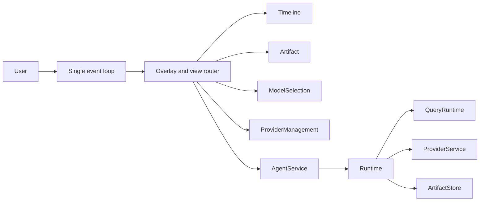

# TUI Interaction Design

## Overview

本 Feature 将 v0.2 Ratatui 界面实现为 `docs/prototypes/ysda-tui.html` 所定义的产品形态。

主界面包含 Header、Timeline、固定 Composer 和 Footer。Query 成功后显示结果卡片；Enter 或点击卡片进入结果详情。

TUI 只公开 `/mode` 和 `/model`。所有产品状态与副作用都经过 AgentService；TUI 只负责展示、输入、焦点和导航。

## 1. User-visible Contract

### Views

| View | Purpose | Entry | Back |
|---|---|---|---|
| Timeline | 显示问题、Query 进度和结果卡片 | 启动或返回 | — |
| Artifact | 显示 Summary、Results、SQL、Schema、Evidence | 结果卡片 | Esc |
| Model Selection | 选择 Provider/Plan 和 Model | `/model` | Esc |
| Provider Management | 补全缺失配置 | `Needs setup` | 完成或 Esc |

Command Palette 和 Mode Picker 是 Overlay。关闭 Overlay 后，原页面和 Composer 内容保持不变。

### Commands

产品命令目录恰好包含：

| Command | Action |
|---|---|
| `/mode` | 打开 `Auto / Query` 选择器 |
| `/model` | 打开 `Providers / Plans → Models` |

解析器、Command Palette、Footer 和帮助界面读取同一个目录。旧入口不保留隐藏解析路径。

只有首个非空白字符是 `/` 时，输入才按命令解析。搜索顺序为精确匹配、前缀匹配、有序字符匹配、描述匹配，最后按 Catalog 顺序稳定排序。

### Keyboard

| Context | Keys | Behavior |
|---|---|---|
| Composer | `/` | 在命令起始位置打开 Command Palette |
| Selector | typing、↑/↓、Enter、Esc | 搜索、移动、确认、取消 |
| Provider/Plan | Tab 或 ←/→ | 切换两个页签 |
| Model list | Esc | 返回原页签并恢复搜索和高亮 |
| Result card | Enter | 打开 Artifact，默认进入 Results |
| Artifact tabs | Tab / Shift+Tab | 切换五个页签 |
| Results table | ↑/↓/←/→ | 移动行列焦点 |
| Artifact | Esc | 返回 Timeline |

结果卡片可在终端启用鼠标时点击；所有必需操作都必须支持键盘。

### Footer

- Timeline 有完成结果卡片：`/mode  /model  Enter open results`
- Artifact：`/mode  /model  Esc back`
- 其他页面：只显示当前可执行的键位。

Footer 只是上下文提示，不是第三套命令目录。

### Out of Scope

- `Custom` 模型、任意 Base URL、新 Provider 和新 Workflow。
- `/providers`、`/query`、`/artifact`、`/sql`、`/datasource`。
- Provider Profile、Credential 和验证规则的重新实现。
- 浏览器 CSS 的逐像素复刻。

## 2. Architecture

### Layer Boundaries

| Layer | Owns |
|---|---|
| `apps/ysda` | 输入路由、reducer、焦点、布局、渲染 |
| `ys-agent-runtime` | Display Context、结果 Preview、模型选择用例 |
| `ys-agent-core` | 安全的 Provider 选择类型与 port |
| `provider-management` | Catalog、Profile、Credential、验证、原子激活 |

TUI 不直接访问 Repository、Vault、Artifact Store、数据库或 Model Provider。



### Decisions

1. 整个 TUI 只消费一个 Crossterm event stream。
2. 输入顺序固定为 Overlay、当前 View、Composer。
3. 命令、Mode、Provider/Plan 和 Model 共用一个无 I/O 列表 reducer。
4. Header 只组合 Display Context、本地 Mode 和权威活动模型。
5. Timeline 按 Event sequence 去重，并由 Run Snapshot 校准。
6. Artifact 只读持久化内容，不调用 Query API。
7. 模型切换成功后必须重新读取活动配置，才能更新 `Current`。
8. 异步结果必须匹配 operation ID 和 route key；过期结果直接丢弃。

### App State

```rust
pub enum ContentRoute {
    Timeline,
    Artifact,
    ModelSelection,
    ProviderManagement,
    Diagnostics,
}

pub enum Overlay {
    CommandPalette,
    ModePicker,
    Help,
    Repair,
    ThemePicker,
}

pub struct TuiApp {
    pub routes: Vec<ContentRoute>,
    pub overlay: Option<Overlay>,
    pub display_context: TuiDisplayContext,
    pub query_mode: TuiQueryMode,
    pub current_model: CurrentModelIndicator,
    pub timeline: TimelineState,
    pub artifact: Option<ArtifactWorkspaceState>,
    pub model_selection: Option<ModelSelectionState>,
    pub composer: ComposerState,
}
```

`routes` 首项始终是 `Timeline`。页面状态单独保存，以便返回时恢复搜索、高亮和滚动位置。

## 3. Service Contracts

### Display Context

```rust
pub enum DatasourceDisplayState {
    Active { display_name: String },
    NotConfigured,
    Unavailable { message: String },
}

pub enum QueryDisplayState {
    Ready,
    Running,
    WaitingForInput,
    Completed,
    NonSuccess { message: String },
}

pub struct TuiDisplayContext {
    pub workspace_display_name: String,
    pub datasource: DatasourceDisplayState,
    pub read_only: bool,
    pub query_state: QueryDisplayState,
}

pub enum TuiQueryMode {
    Auto,
    Query,
}
```

AgentService 提供：

```rust
async fn tui_display_context(&self) -> CoreResult<TuiDisplayContext>;
```

Display Context 不得包含 DSN、Credential、ACL 主体、内部 ID、内部 phase、Event payload 或业务数据行。

Controller 在启动、Query 状态变化、数据源变化、Provider 操作完成和用户 retry 时刷新它。失败时保留最后一次成功值，并显示 `status unavailable`。

`Auto` 在 v0.2 中解析到 Query；`Query` 显式锁定 Query。Mode 是本地 UI 状态，不改变 Policy、Tool、Budget、Provider binding 或 Completion Gate。

### Timeline and Result

Timeline 的事实来源按以下优先级合并：

1. 持久化 Query Artifact；
2. 终态 Run Snapshot；
3. 运行中的 Run Snapshot；
4. typed Event；
5. Service Reply。

低优先级信息不得覆盖高优先级结论。Event 断档或重连时，Controller 重新读取 Run Snapshot。

只有成功且存在主要 Query Artifact 时才创建结果卡片。Enter 或点击只执行 `Timeline → Artifact(Results)`，不得调用 `send_message`、`resume_task` 或 Tool API。

Artifact 页签：

| Tab | Content |
|---|---|
| Summary | 答案、Intent、Semantic Status、Source、Sensitivity、Verification、Warnings |
| Results | 受限表格、行列数、截断状态、焦点 |
| SQL | 已执行 SQL、安全参数摘要、`view only · no rerun` |
| Schema | 实际字段类型、推断语义、允许披露的来源 |
| Evidence | 证据类型、安全摘要、状态 |

Runtime 应先执行 Artifact Policy，再解析完整结果并生成 Preview。默认上限为 100 行、每个 cell 256 个显示字符、总计 64 KiB。

TUI 不能提高上限，也不能从截断 JSON 自行构造结果。

```rust
pub struct QueryResultPreviewView {
    pub columns: Vec<String>,
    pub rows: Vec<Vec<serde_json::Value>>,
    pub persisted_row_count: usize,
    pub returned_row_count: usize,
    pub truncated: bool,
}

async fn query_result_preview(
    &self,
    artifact_id: &ArtifactId,
    access: ArtifactAccessContext,
) -> CoreResult<QueryResultPreviewView>;
```

`truncated` 只表示 UI Preview 被限制。Query 本身是否截断继续读取 Query Artifact 的 warning。

### Model Selection

Provider/Plan 分类由 Catalog 返回，TUI 不维护分类常量。

每个顶层候选包含显示名、`Configured / Needs setup / Unavailable` 状态。当前项另有唯一的 `Current` 标记。

每个 Model 候选包含 Profile 名、模型名、验证状态和稳定 key。

稳定 key 必须包含：

```rust
pub struct ModelCandidateKey {
    pub profile_id: ProfileId,
    pub expected_profile_revision: u64,
    pub expected_activation_revision: Option<u64>,
    pub provider: ProviderId,
    pub model: ProviderModelId,
}
```

候选 view 不得包含 Credential、URL、参数正文、validation digest 或请求内容。

`ProviderManagementApi` 拥有用例，AgentService 负责转发：

```rust
async fn model_selection_snapshot(&self)
    -> ProviderResult<ModelSelectionSnapshot>;
async fn list_model_candidates(&self, request: ListModelCandidatesRequest)
    -> ProviderResult<ModelCandidateBatch>;
async fn switch_model(&self, request: SwitchModelRequest)
    -> ProviderResult<ActiveProviderView>;
```

选择流程：

1. `/model` 加载 Provider/Plan snapshot。
2. `Configured` 进入 Model 列表。
3. `Needs setup` 进入既有 Provider Management，随后返回原位置。
4. Service 合并已保存模型和发现结果；不同 Profile 的同名模型保留为多行。
5. `Ready` 候选可直接原子激活。
6. 首次使用的模型先保存 Draft revision，再验证，最后原子激活。
7. 成功后重新读取活动配置、selection snapshot 和 Display Context。
8. 失败、取消、超时或冲突时，原 active pointer 和 Header 保持不变。

Profile revision 或活动 revision 不匹配时，Service 返回 `Conflict`。发现失败时仍显示已保存且状态可证明的候选。

切换只影响新 Run。已经启动的 Run 继续使用启动时绑定的 Provider、Model、Credential generation 和参数。

## 4. Rendering

### Layout

| Class | Size | Required behavior |
|---|---|---|
| Wide | `>= 120×30` | 完整 Header、Timeline、五页签和表格列 |
| Standard | `>= 80×20` | 合并 Header 标签，缩减次要列 |
| Compact | `>= 60×12` | 保留产品、主要状态、内容、Composer 和一行键位 |

低于最小尺寸时显示不重叠的尺寸提示，并保留退出或返回键。

### Rules

- 使用现有 `deep-navy` token；cyan 表示当前，green 表示成功，amber 表示警告，red 表示失败。
- 外部文本先清理控制字符，再限制宽度并安全换行。
- Workspace、Datasource、Read-only 和 Query 状态只读 Display Context。
- Mode 只读 `TuiQueryMode`；当前模型只读权威活动 Provider view。
- 非成功状态不得显示成功色或 `verified`。
- 生产界面不得显示原型 fixture 文案。

## 5. Invariants and Failures

### Invariants

- 同一时刻最多一个 Overlay。
- 非空列表恰有一个高亮项；空列表没有伪选择。
- 当前模型只由 `ActiveProviderView` 构造。
- Display Context 只由 AgentService completion 更新。
- 不同 Profile 的同名模型不得合并。
- Timeline terminal 状态不能被旧 Event 降级。
- Artifact 导航不得调用 Query、Tool 或 resume API。
- 默认渲染树不得包含 Secret、完整 DSN、内部 ID 或 raw payload。

### Failure Behavior

| Failure | UI | Guarantee |
|---|---|---|
| Display Context 失败 | 保留最后值，显示不可用 | 不猜 Header |
| Catalog 失败或为空 | 错误或空状态，支持 retry | 不生成候选 |
| Discovery 失败 | 显示已保存候选和限制 | 不伪造 Ready |
| Needs setup | 进入既有配置流程 | 不发 switch |
| 认证或验证失败 | 显示原因和修复动作 | active 不变 |
| Conflict 或 stale result | 丢弃并刷新 | 不覆盖新状态 |
| Artifact 缺失或受限 | 显示真实原因 | 不绕过 Policy |
| Event gap | 重读 Snapshot | 不追加猜测阶段 |
| 终端过小 | 显示尺寸提示 | 不 panic、不重叠 |

错误文案只使用稳定错误码和已清理摘要，不渲染 transport body、header、token 片段或 Provider 原始回显。

### Concurrency

- Event loop 不执行阻塞 I/O。
- Provider mutation 同一时刻只允许一个；Catalog 和 Artifact 读取可以并行。
- 搜索只在 query 或候选变化时计算。
- Timeline 不保存无界 raw payload；Results 只渲染当前 viewport。
- Display Context 不得每帧刷新。

## 6. Implementation and Verification

### Change Map

| Area | Change |
|---|---|
| `ys-agent-core` | Provider/Plan 分类、Model Selection safe view 和 port |
| `ys-agent-runtime` | Display Context、结果 Preview、候选合并、安全切换 |
| `apps/ysda/tui` | command catalog、selector、Mode、Timeline、Artifact、Model Selection |
| Event loop | Overlay 优先路由、operation ID、stale result 防护 |
| Tests | Service contract、真实 KeyEvent、多尺寸 golden |

主要文件：

- `crates/ys-agent-core/src/{provider,ports}.rs`
- `crates/ys-agent-runtime/src/provider/{api,service}.rs`
- `crates/ys-agent-runtime/src/service.rs`
- `apps/ysda/src/tui/{app,input,event_loop,ui}.rs`
- `apps/ysda/src/tui/{command_catalog,selection,mode_picker,timeline,artifact_workspace,model_selection}.rs`

本 Feature 不增加数据库 migration。

### Required Tests

1. 命令目录恰好包含 `/mode` 和 `/model`。
2. `/mode` 只显示 `Auto` 与 `Query`；Esc 恢复旧状态。
3. `/model` 支持两级选择、搜索、确认和逐层返回。
4. 切换成功后 Header 更新；失败、取消和冲突后保持不变。
5. Run A 保持旧 binding；切换后启动的 Run B 使用新 binding。
6. 结果卡片进入 Results；切页和返回期间 Query 调用计数为零。
7. waiting、warning、denied、failed、cancelled 都有明确非成功渲染。
8. Display Context、候选和 Artifact 不泄露 Secret、DSN、内部 ID 或 raw payload。
9. `150×40`、`100×28`、`60×12` 使用同一生产 renderer 生成 golden。

真实交互测试必须通过 `crossterm::event::KeyEvent` 驱动公开输入路径，不能直接修改 reducer 私有字段。

### Requirement Traceability

| Requirement | Design section | Main evidence |
|---|---|---|
| R1 | Display Context、Rendering | 来源负向测试、三尺寸 golden |
| R2 | Timeline and Result | 状态矩阵、no-rerun |
| R3 | Commands、Keyboard、Mode | Catalog 成员、真实 KeyEvent |
| R4 | Model Selection | Catalog/Profile/验证集成 |
| R5 | Model Selection、Invariants | 原子失败、并发 Run |
| R6 | Invariants and Failures | 泄漏负向测试、端到端回归 |

## 7. Rollout

1. 增加安全类型、Display Context、结果 Preview 和 Service contract tests。
2. 增加命令目录、通用 selector、Mode Picker 和 Model Selection。
3. 增加 Timeline、结果卡片和 Artifact 工作区。
4. 切换生产 renderer，并运行全部键盘、golden、激活和 Run binding 回归。

旧入口不保留 feature flag 或双实现。真实状态缺少原型字段时，UI 显示空状态，并回到对应 Service 契约补齐。

以下变化要求重新验证本设计：AgentService、ProviderManagementApi、Event、Run Snapshot、QueryArtifact、Catalog 分类、Profile revision、active CAS、Ratatui/Crossterm 输入语义或 Preview 限制。

## References

- `docs/prototypes/ysda-tui.html`
- `.kiro/specs/provider-management/{requirements,design}.md`
- `/Users/ysc/Documents/Data_Engineering/projects/Datus-agent-opencode-go/datus/cli/model_app.py`
- `/Users/ysc/Documents/Data_Engineering/projects/Datus-agent-opencode-go/datus/cli/slash_registry.py`
